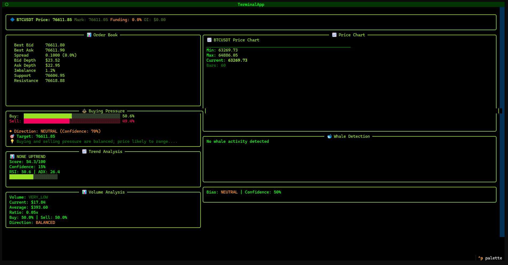

  
<h1 align="center">🔍 CryptoAnalyzer</h1> <h3 align="center">Professional Binance Futures Market Analysis Terminal</h3>
  

     

 <b>Real-time market intelligence, whale detection, and multi-factor analysis — all in your terminal.</b> 

🎯 About The Project
CryptoAnalyzer is a professional-grade terminal application for Binance Futures. It provides institutional-level market analysis directly in your terminal — no bloated GUIs, just pure data intelligence.

✨ Features
Module	Capabilities
📊 Order Book	1000+ depth, Support/Resistance, Liquidity Clusters
📈 Trend	EMA 9/21/50/200, RSI, ADX, Price Structure
💹 Volume	Buy/Sell Split, CVD, Volume Spikes, Tape Reading
🐋 Whale	Large Order Detection, Whale Bias, Wall/Spoof Detection
🖥️ TUI	Hacker Theme, Live Auto-Refresh, ASCII Charts
📸 Terminal Preview
text

┌──────────────────────────────────────────────────────────────┐
│ 🔍 CRYPTO ANALYZER | BTCUSDT | ⚡ LONG BIAS | 14:23:11 │
├──────────────────────────────────────────────────────────────┤
│ 📊 ORDER BOOK │ 📈 TREND ANALYSIS │
│ Best Bid: 67,234.50 │ EMA 9: 67,401 ▲ │
│ Best Ask: 67,235.00 │ RSI: 62.4 (Bullish) │
│ Depth ±2%: 4.2M USDT │ ADX: 28.7 (Strong Trend) │
└──────────────────────────────────────────────────────────────┘
🚀 Installation
batch

git clone https://github.com/Daniyalmasih/CryptoAnnalyzer.git
cd CryptoAnnalyzer
setup.bat
run.bat
🎮 How to Run
Tumhe CMD yaad nahi? Tension nahi.
Bas run.bat par double-click karo, bot khud run ho jayega.

📬 Connect With Me

      

 <b>⭐ Star this repo if you find it useful!</b>  Made with ❤️ by Daniyal Masih 

